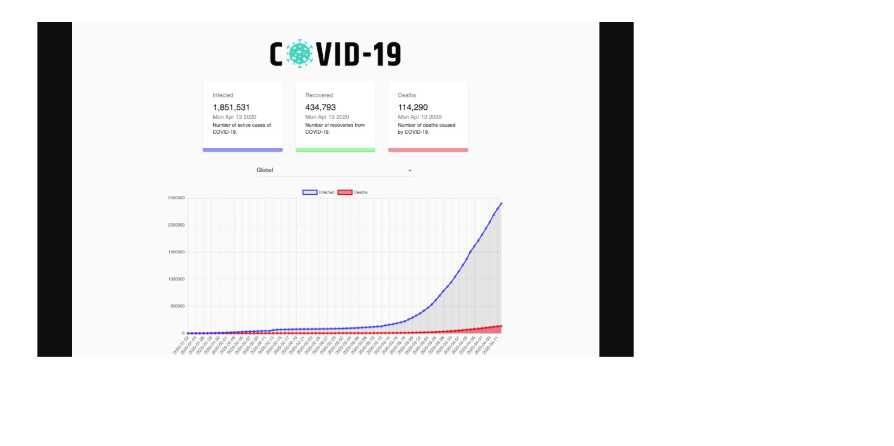

# COVID-19 Tracker

### [Live Site](https://6047e7f06e0edd008ce642d3--stoic-hermann-1713d9.netlify.app/)

## Introduction

This is a code repository for the corresponding video tutorial.

In this video, we will create a full COVID-19 Tracker. We're going to use React,
Charts.JS and Material UI.

By the end of this video, you will have a strong understanding of React's
workflow and the use of hooks.

API used: https://covid19.mathdro.id/api

Setup:

- run `npm i && npm start`
